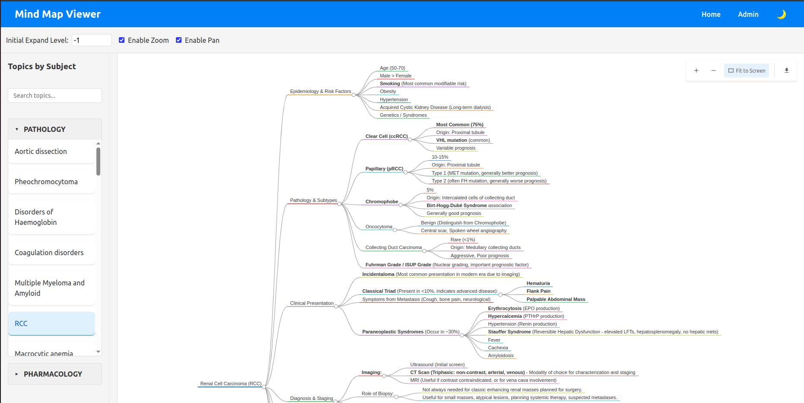
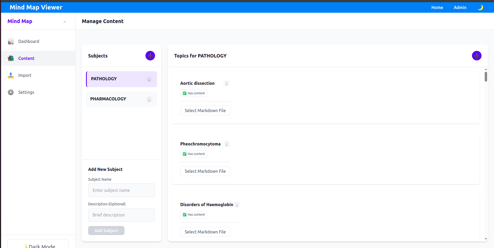

# Mind Map Viewer

A modern web application for visualizing and managing mind maps, built with React, TypeScript, and MongoDB.

## Features

- Interactive mind map visualization using D3.js
- Real-time search functionality
- Dark mode support
- Responsive design for all devices
- Admin panel for managing subjects and topics
- Markdown content support
- ZIP file import/export functionality
- Serverless deployment ready

## Tech Stack

- Frontend:
  - React with TypeScript
  - D3.js for mind map visualization
  - Tailwind CSS for styling
  - Vite for build tooling

- Backend:
  - Node.js with Express
  - MongoDB for data storage
  - Serverless deployment support


## Getting Started


### UI

### Home Page


### Admin Page




### Prerequisites

- Node.js (v14 or higher)
- MongoDB (local or Atlas)
- npm or yarn

### Installation

1. Clone the repository:
```bash
git clone https://github.com/yourusername/mind-map-viewer.git
cd mind-map-viewer
```

2. Install dependencies:
```bash
# Install frontend dependencies
cd mind-map-viewer
npm install

# Install backend dependencies
cd ../backend
npm install
```

3. Set up environment variables:
Create a `.env` file in the backend directory:
```env
MONGODB_URI=your_mongodb_connection_string
PORT=3002
NODE_ENV=development
CORS_ORIGIN=http://localhost:3000
```

### Development

1. Start the backend server:
```bash
cd backend
npm run dev
```

2. Start the frontend development server:
```bash
cd mind-map-viewer
npm run dev
```

The application will be available at:
- Frontend: http://localhost:3000
- Backend API: http://localhost:3002

## Available Scripts

### Frontend

- `npm run dev` - Start development server
- `npm run build` - Build for production
- `npm run preview` - Preview production build
- `npm run lint` - Run ESLint
- `npm run type-check` - Run TypeScript type checking


## Project Structure

```
mind-map-viewer/
├── src/
│   ├── components/     # React components
│   ├── services/       # API services
│   ├── types/          # TypeScript types
│   ├── utils/          # Utility functions
│   └── App.tsx         # Main application component
├── public/             # Static assets
└── package.json


## Deployment

### Vercel Deployment

1. Push your code to a GitHub repository
2. Connect your repository to Vercel
3. Configure environment variables in Vercel dashboard
4. Deploy!

### Environment Variables

Required environment variables for production:
```env
MONGODB_URI=your_mongodb_connection_string
CORS_ORIGIN=your_frontend_url
NODE_ENV=production
```

## Contributing

1. Fork the repository
2. Create your feature branch (`git checkout -b feature/amazing-feature`)
3. Commit your changes (`git commit -m 'Add some amazing feature'`)
4. Push to the branch (`git push origin feature/amazing-feature`)
5. Open a Pull Request

## License

This project is licensed under the MIT License - see the [LICENSE](LICENSE) file for details.

## Acknowledgments

- [D3.js](https://d3js.org/) for mind map visualization
- [React](https://reactjs.org/) for the frontend framework
- [MongoDB](https://www.mongodb.com/) for data storage
- [Vercel](https://vercel.com/) for deployment platform
